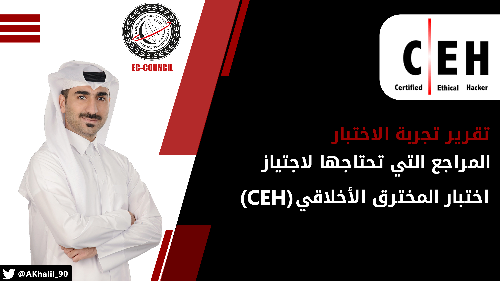

<h1 dir="rtl" align="right">تجربتي مع اختبار CEH</h1>

<h2 dir="rtl" align="right">مقدمة</h2>

من أشهر شهادات الأمن السيبراني هي شهادة المخترق الأخلاقي المعتمد (<a href="https://www.eccouncil.org/programs/certified-ethical-hacker-ceh/">Certified Ethical Hacker</a>) من (<a href="https://www.eccouncil.org/">EC-Council</a>). عنوان الشهادة لوحده يجذب كل مهتم في مجال الأمن السيبراني.

هذه الشهادة مصممة لاختبار واعتماد جهازية المتقدم في القيام بعمليات تحديد وتقييم نقاط الضعف في البنية التكنولوجية (Vulnerability Assessment)، ومعرفته بآلية ومراحل الاختبار الأخلاقي (Penetration Test)، بالإضافة إلى الطرق التي ينتهجها المخترق والمراحل التي يمر بها للحصول على المعلومات والوصول إلى البنية التحتية بشكل غير أخلاقي.

تلاقي هذه الشهادة ترويجا تجاريا كبيرا مقارنة بالشهادات الأخرى من نفس المجال، ولذلك تعترف بأهميتها معظم الشركات والمؤسسات، بالرغم من أنها فعليها مناسبة لمن يقوم بالبدء بمجال الأمن السيبراني والاختبار الأخلاقي.

<h2 dir="rtl" align="right">المجالات (Domains) المغطاة ضمن شهادة CEH</h2>

يضم منهج الشهادة عدد (7) مجالات رئيسية وهي كالتالي:

<ol dir="rtl">
<li><strong>Background:</strong> يغطي هذا المجال أساسيات التكنولوجيا في مجال الشبكات والاتصالات، أساسيات وأنواع الاختراقات المختلفة، ومصطلحات أمن المعلومات الرئيسية.</li>
<li><strong>Analysis / Assessment:</strong> هذا المجال يغطي موضوع تقييم وتحليل مستوى أمن المعلومات، بالإضافة إلى المراحل التي يمر بها المخترق في عملية الاختراق.</li>
<li><strong>Security:</strong> هذا المجال يغطي مختلف الأنظمة والآليات التي تساهم في حماية أمن المعلومات مثل: Firewalls, IDS/IPS, Disk Encryption, Network Security, Physical Security وغيرها.</li>
<li><strong>Tools / Systems / Programs:</strong> هذا المجال يعتبر من أهم المجالات في محتوى الشهادة حيث أنه يغطي أهم الأدوات والبرامج التي يتم استخدامها في جميع مراحل الاختراق مثل: Nmap, Hping, Snort, John The Ripper, Nessus وغيرها الكثير والكثير من الأدوات.</li>
<li><strong>Procedures / Methodology:</strong> هذا المجال يغطي الاجراءات المتبعة في تصميم بنية تحتية آمنة، بالإضافة إلى المنهجيات المتبعة لاختراق الخوادم والشبكات السلكية واللاسلكية وقواعد البيانات والمواقع الإلكترونية.</li>
<li><strong>Regulation / Policy:</strong> مثل أغلب شهادات أمن المعلومات، يغطي هذا المجال بشكل بسيط سياسات أمن المعلومات المختلفة.</li>
<li><strong>Ethics:</strong> لا يمكن التحدث عن الاختراق الأخلاقي من دون الحديث عن أخلاقيات العمل والمهنة، لذا هذا المجال يقوم بتغطية بسيطة لجزئية الأخلاقيات المتوقعة من المخترق الأخلاقي.</li>
</ol>
<h2 dir="rtl" align="right">تفاصيل الاختبار</h2>

هذه التفاصيل ستقوم بالإجابة على استفسارات العديد من المهتمين في تقديم الاختبار:

<ul dir="rtl">
<li><strong>عدد الأسئلة: </strong>125 سؤال</li>
<li><strong>مدة الاختبار: </strong>240 دقيقة (4 ساعات)</li>
<li><strong>درجة النجاح:</strong> تختلف درجة النجاح حسب الاختبار الذي ستقدمه. بعد بحثي في الانترنت، توصلت بأن نسبة النجاح تكون غالبا ما بينا %70 إلى 80%. ستتمكن من معرفة درجة النجاح قبل بدء اختبارك ، حيث يتم الإعلان عنها قبل ضغطك على زر "Start Test".</li>
<li><strong>رسوم الاختبار: </strong>1,199 دولار أمريكي (غالية جدا مقارنة بالشهادات الأخرى. في حالتي حصلت على الاختبار بشكل مجاني ضمن برنامج تدريبي يقدم من الحكومة لمن يعمل في مجال تكنولوجيا المعلومات).</li>
<li><strong>مقر تقديم الاختبار: </strong>يمكنك تقديم الاختبار في المقرات المعتمدة، حيث يتم إدارة اختبارات EC-Council من قبل <a href="https://www.pearsonvue.com/">Pearson Vue</a> (تأكد بأن هناك مقر اختبار في دولتك أو بالقرب منك). كما أنه يمكن تقديم الاختبار عن بعد (من منزلك أو من أي مكان آخر) عن طريق إضافة 100 دولار أمريكي.</li>
</ul>
<h2 dir="rtl" align="right">المراجع المستخدمة في التحضير للاختبار</h2>

هذه المراجع التي استخدمتها خلال فترة التحضير:

<ul dir="rtl">
<li><a href="https://www.amazon.com/Certified-Ethical-Hacker-Guide-Fourth/dp/126045455X/ref=pd_lpo_14_t_0/147-7316318-9252863?_encoding=UTF8&amp;pd_rd_i=126045455X&amp;pd_rd_r=33f9f1f2-67b1-40c1-8c8a-213f9d1848a6&amp;pd_rd_w=A3wmQ&amp;pd_rd_wg=QRAFj&amp;pf_rd_p=7b36d496-f366-4631-94d3-61b87b52511b&amp;pf_rd_r=TVV3SW55R80B46QVE386&amp;psc=1&amp;refRID=TVV3SW55R80B46QVE386">كتاب CEH All-in-One Exam Guide</a>: استخدمت هذا الكتاب كمرجي أساسي للاستعداد للاختبار. يحتوي الكتاب على ما يقارب (500) صفحة. وجدت بأن الكتاب بسيط جدا للقارئ وتشعر بأن الكاتب يخاطبك ويتحدث معك، ولكن ما لم يعجبني بأن وكأن الكاتب كان يحاول زيادة صفحات الكتاب عن طريق ذكر الكثير من القصص والحوارات التي ليس لها داع، ولكن هذا الأسلوب قد يعجب البعض. يتضمن الكتاب أسئلة بعد كل فصل، بالإضافة إلى عدد (300) سؤال كاختبارات تدريبية.</li>
<li><a href="https://scottymcraig.github.io/CEHv10StudyGuide/">مخلص Scott Craig لكتاب CEH All-in-One Exam Guide:</a> قام هذا الشخص بمجهود رائع جدا في تلخيص الكتاب بشكل ممتاز جدا. فقد استخدمت هذا الملخص لمراجعة ما قمت بقراءته في الكتاب بشكل سريع ومرتب.</li>
<li><a href="https://www.udemy.com/course/ethicalhacker/">اختبارات تدريبية مقدمة من Jason Dion على منصة Udemy:</a> قمت بشراء هذه الاختبارات التدريبية من Udemy بمبلغ 9.99 باوند إسترليني (13 دولار أمريكي تقريبا). تحتوي الحزمة على إجمالي (200) سؤال مقسمة على (4) اختبارات تدريبية، بحيث يحتوى كل اختبار على (50) سؤال. من وجهة نظري بأن درجة صعوبة الأسئلة تفوق بمراحل مستوى صعوبة الاختبار الحقيقي، ولن تساعدك على تحديد درجة جهازيتك للاختبار، ولكن ستفيدك في تحديد مجالات الضعف لديك والتي قد تحتاج لقراءتها مرة أخرى أو إعادة مراجعتها.</li>
<li><a href="https://hackersidea.blogspot.com/p/blog-page.html">أسئلة مجانية:</a> يحتوي هذا الرابط على أكثر من (500) سؤال، وتتشابه بشكل كبير جدا مع أسئلة الاختبار. أوصي أن تقوم بمراجعتها جميعها قبل الاختبار بأيام.</li>
</ul>

&nbsp;

<h2 dir="rtl" align="right">المنهجية التي قمت باتباعها للتحضير للاختبار</h2>

هذه هي المنهجية التي اتبعتها شخصيا في التحضير والاعداد للاختبار والتي أشاركها معكم للمنفعة العامة، ولكن يمكنك اتباع المنهجية التي تراها مناسبة بالنسبة لك:

<ol dir="rtl">
<li dir="rtl">البدء بقراءة كتاب (CEH All-in-One Exam Guide) بمعدل (30) صفحة يوميا. استغرقت ما يقارب (3) أسابيع لإنهاء الكتاب بشكل كامل. كما أنني كنت أقوم بالقيام باختبار نهاية الفصل بشكل جدي لضمان فهمي لمحتوى الفصل الذي قرأته.</li>
<li>بعد الانتهاء من قراءة الكتاب بشكل كامل، قمت بمراجعة ملخص (Scott Craig) للكتاب على مدى (4) أيام، مع البحث والاطلاع على أي من المواضيع التي ما زالت غير واضحة بالنسبة لي.</li>
<li>بعد الانتهاء من مراجعة جميع المجالات والمواضيع الخاصة بالشهادة، قمت بالتدرب على الإجابة على عدد (300) سؤال والتي تأتي مع كتاب (CEH All-in-One Exam Guide)، وعدد (200) سؤال من الكورس الذي قمت بشرائه من Udemy، وعدد (250) سؤال من أصل أكثر من (500) سؤال من رابط الأسئلة المجانية الذي ذكرته في قسم المراجع التي قمت باستخدامها للتحضير للاختبار.</li>
</ol>
<h2 dir="rtl" align="right">تجربتي يوم الاختبار</h2>
<ul dir="rtl">
<li>هذه أول تجربة لي بخوض اختبار عن بعد على طريقة (Remote Proctoring)، بحيث يكون هناك مراقب معك طول فترة الاختبار يراقب شاشتك ويراقبك عن طريق الكاميرا. الجدير بالذكر أنني قمت بدفع (100) دولار أمريكي إضافية لعمل الاختبار عن بعد.</li>
<li>قبل البدء بالاختبار، ظهرت أمامي الدرجة المطلوبة للنجاح وكانت (78%) مما يعادل الإجابة على عدد (98) سؤال بشكل صحيح من أصل (125) سؤال.</li>
<li>لم يكن الاختبار صعبا إطلاقا، حيث أن الخيارات في كل سؤال لا تعمل على تشتيت الشخص أبدا، ووجدتها مباشرة جدا وسهلة الإجابة، على عكس اختبار (CISSP)، على سبيل المثال، والتي تكون الإجابات متقاربة جدا، وقد تكون أكثر من إجابة صحيحة!</li>
<li>قمت ولله الحمد باجتياز الاختبار بنتيجة (96%)، ما يقارب الإجابة على (120) إجابة بشكل صحيحة من إجمالي (125) سؤال.</li>
<li>انهيت الاختبار بشكل كامل في (1 ساعة و 45 دقيقة)، حيث لم أكن بحاجة إلى الساعات المتبقية بالرغم من وجود خاصية الرجوع إلى الأسئلة ومراجعتها.</li>
</ul>
<h2 dir="rtl" align="right">مقتطفات أخرى</h2>
<ul dir="rtl">
<li>

لا تحتاج إلى مهارات عملية لاجتياز الاختبار. يكفي أن تأخذ فكرة عامة عن الأدوات المذكورة في الكتاب أو المنهج الخاص بالشهادة عن طريق مشاهدة فيديوهات عن الأداة، أو تجربتها لمرة أو مرتين. علما بأنني أوصي بتجربة جميع الأدوات بشكل عملي، حيث أن الهدف هو التعلم والاستفادة، وليس اجتياز الاختبار فقط.

</li>
<li>

الاختبار سهل جدا، ويمكن لأي شخص لديه خبرة بسيطة في مجال الأمن السيبراني دراسة المنهج واجتياز الاختبار بنجاح، خصوصا أن أسئلة الاختيار سهلة نوعا ما، ودرجة النجاح المطلوبة ليست عالية.

</li>
<li>

الشهادة مطلوبة في سوق العمل ومعروفة لدى المؤسسات والشركات، لذا أوصي بالحصول عليها.

</li>
</ul>
<h2 dir="rtl" align="right">التواصل</h2>

يمكنك التواصل معي على تويتر: <a href="https://www.twitter.com/AKhalil_90">@AKhalil_90</a>

